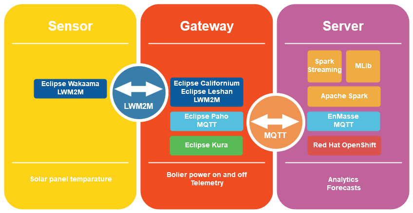

# Smart solar water heating

Smart solar water heating solution uses IoT and AI technologies to improve the efficiency of passive solar water heating system. This solution is designed to take part in the Open IoT Challenge 4.0!

## Solar water heating
Solar water heating (SWH) is the conversion of sunlight into heat for water heating using a solar thermal collector. Solar water heating systems include storage tanks and solar collectors. There are two types of solar water heating systems: active, which have circulating pumps and controls, and passive, which don't.
Passive solar water heating systems are typically less expensive than active systems, but they're usually not as efficient. However, passive systems can be more reliable and may last longer.

The solar panels heat the water in the storage tank when they are affected by the sun rays. The water reaches the highest temperature when the sun is stronger. If the water in the solar panel is hot the divert valve close the flow towards the boiler so the boiler turn off. There are two factors that reduce the system efficiency: boiler distance and thermal dispersion. 

### Boiler distance
Often the boiler lights up, when users open the hot water valve, because the water in the pipe is too cold. If the water in the solar panel is hot and the water in the pipe is cold, the boiler lights up. The lighting up time is proportional to distance between boiler and solar panel because the divert valve close the flow towards the boiler as soon as the hot water arrives. In this case the boiler waste the energy consumed because the lighting up time isn't enough to heat up the water.

### Thermal dispersion
When it is cloudy or it is night the solar panels don't heat the water in the storage tank, so the thermal dispersion reduces the temperature of the water. If the water isn't used when it is hot the efficiency of the system is reduced.
Improve the efficiency
Smart solar water heating solution uses a temperature sensor to power off the boiler when the water is heat enough. This avoids the power on of the boiler for the cold water in the pipe. Furthermore the solution uses a gateway to send this data to a server using artificial intelligence to make a forecast for hot water availability, combining this data with weather forecast. This allows the user to know with advances the hot water availability so he can schedule the use of hot water minimizing the thermal dispersion.

## Technologies
The temperature sensor is based on a ESP8266 with a thermal probe that uses Eclipse Wakaama to implement LWM2M protocol. The gateway is based on a Raspberry Pi that uses Eclipse Kura for building the IoT gateway, Eclipse Californium and Eclipse Leshan to implement LWM2M and Eclipse Paho to implement MQTT. The server uses Red Hat OpenShift to host the container that runs EnMasse and Apache Spark to analyzing the data to make a forecast for hot water availability.

## License
This project is licensed under the Apache License 2.0 - see the [LICENSE.md](LICENSE.md) file for details
