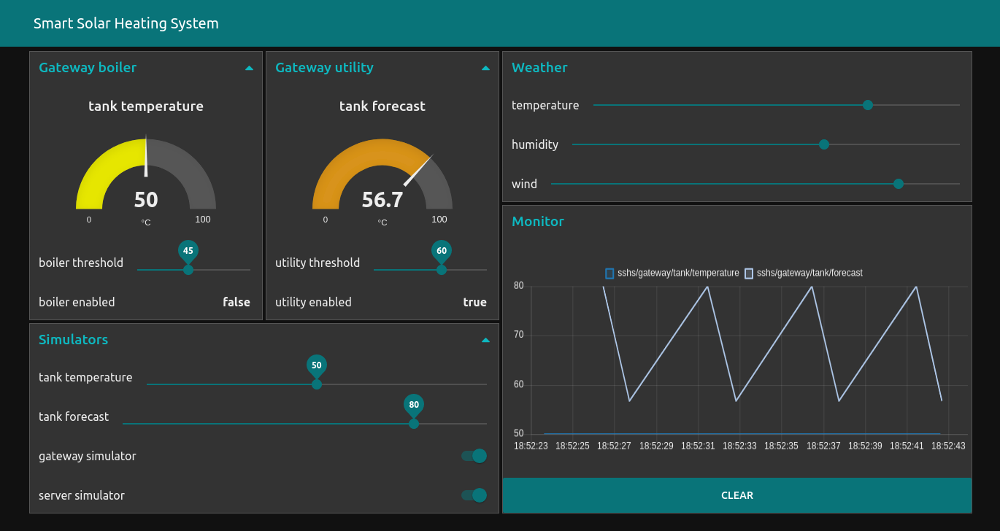

The dashboard uses a [Node-RED](https://nodered.org) to run the flow.

Install node-red https://nodered.org/docs/getting-started/local

Install node-red-dashboard https://flows.nodered.org/node/node-red-dashboard

Import the `flow.json`

http://127.0.0.1:1880/

http://127.0.0.1:1880/ui/