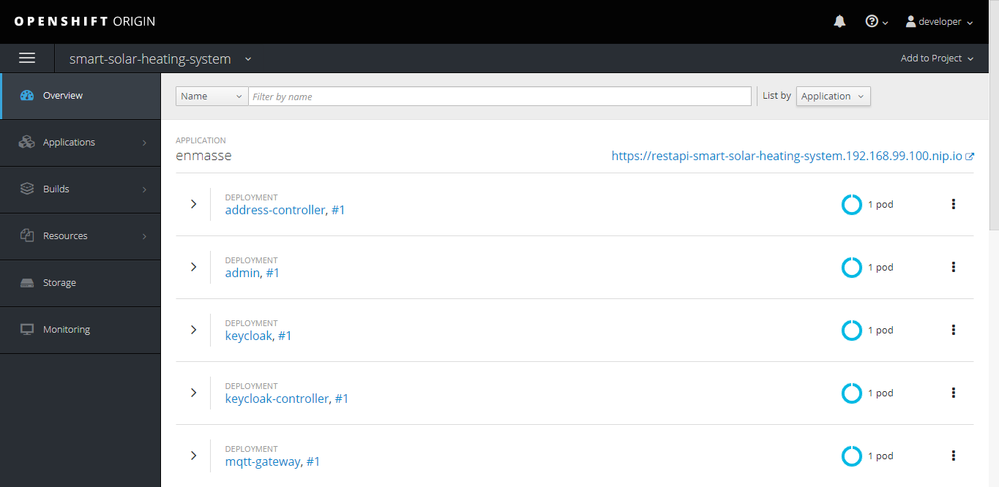

The server uses a computer with OpenShift to deploy EnMasse and Apache Spark. The sources of the project are available on GitHub: https://github.com/brusdev/smart-solar-heating-system/tree/master/server



## OpenShift
OpenShift is a computer software product from Red Hat for container-based software deployment and management. It is a supported distribution of Kubernetes using Docker containers and DevOps tools for accelerated application development. OpenShift may be executed locally by running a single-node OpenShift cluster inside a VM using minishift but it requires a hypervisor to start the virtual machine on which the OpenShift cluster is provisioned. The full installation documentation may be found here: https://docs.openshift.org/latest/minishift/getting-started/installing.html.
You need at least 4 CPU cores 8GB of RAM for your minishift instance since we're running both EnMasse and Spark on a local OpenShift cluster.

```
minishift start --cpus 4 --memory 8GB
```

Once this command completes, the OpenShift cluster should be ready to use.

The relase contains install bundles as well as components for deploying EnMasse and you can create the project `enmasse-spark`.

```
eval $(minishift oc-env)
oc login
oc new-project enmasse-spark
```


## EnMasse
EnMasse is an open source messaging platform, with focus on scalability and performance. EnMasse can run on your own infrastructure or in the cloud, and simplifies the deployment of messaging infrastructure and promotes open standards like AMQP and MQTT etc. and aims to provide support for other protocols as well.
In order to deploy EnMasse you can follow this [Documentation for EnMasse on OpenShift](https://enmasse.io/documentation/0.30.1/openshift/) mainly based on downloading the latest EnMasse release from [here](https://github.com/EnMasseProject/enmasse/releases), and executing following commands for a manual deployment:

Unpack the release archive:

```
tar xvf enmasse-0.30.1.tgz
```

Run the following command to substitute the default project name enmasse-infra:
```
sed -i 's/enmasse-infra/enmasse-spark/' install/bundles/enmasse/*.yaml
```

Log in as a user with cluster-admin privileges:
```
oc login -u system:admin
```

Deploy using the enmasse bundle:
```
oc apply -f install/bundles/enmasse
```

Install the example plans and infrastructure configuration:
```
oc apply -f install/components/example-plans
```

Install the example roles:
```
oc apply -f install/components/example-roles
```

Install the standard authentication service:
```
oc apply -f install/components/example-authservices/standard-authservice.yaml
```

Creating address space with commond line

```yaml
apiVersion: enmasse.io/v1beta1
kind: AddressSpace
metadata:
  name: myspace
spec:
  type: standard
  plan: standard-unlimited-with-mqtt
  authenticationService:
    name: standard-authservice
```

```
oc create -f myspace.yaml
```

Creating sshs topic with commond line

```yaml
apiVersion: enmasse.io/v1beta1
kind: Address
metadata:
    name: myspace.sshs
spec:
    address: sshs
    type: topic
    plan: standard-large-topic
```

```
oc create -f sshs-topic.yaml
```

Creating user with commond line

```yaml
apiVersion: user.enmasse.io/v1beta1
kind: MessagingUser
metadata:
  name: myspace.brusdev
spec:
  username: brusdev
  authentication:
    type: password
    password: cGFzc3dvcmQ=
  authorization:
    - addresses: [ "*" ]
      operations: [ "send", "recv", "view" ]
    - operations: [ "manage" ]
```

```
oc create -f brusdev-user.yaml
```

Create a port-forward for mqtt
```
oc port-forward `oc get pod | grep -o "^mqtt-gateway\S*"` 8883:8883
```

Redirects tcp connections coming in to the local mqtt port
```
redir --laddr=`hostname -I | awk '{print $1;}'` --lport=8883 --caddr=127.0.0.1 --cport=8883 --debug
```

## Apache Spark
Spark is a fast and general cluster computing system for Big Data. It provides high-level APIs in Scala, Java, Python, and R, and an optimized engine that supports general computation graphs for data analysis. It also supports a rich set of higher-level tools including Spark SQL for SQL and DataFrames, MLlib for machine learning, GraphX for graph processing, and Spark Streaming for stream processing. Spark can run on clusters managed by Kubernetes. This feature makes use of native Kubernetes scheduler that has been added to Spark.
In order to deploy Spark you can follow this [Running Spark on Kubernetes](https://spark.apache.org/docs/2.4.4/running-on-kubernetes.html) mainly based on downloading the latest Spark release from [here](https://github.com/apache/spark/releases), and executing following commands:

Sets minishift Docker environment
```
eval $(minishift docker-env)
eval $(minishift oc-env)
```

Build the spark docker image
```
docker build -t brusdev/spark:latest -f ~/Downloads/spark-2.4.4-bin-hadoop2.7/kubernetes/dockerfiles/spark/Dockerfile ~/Downloads/spark-2.4.4-bin-hadoop2.7
```

Build the sshs-server-spark docker image
```
mvn -f server/spark-app/pom.xml -Pbuild-docker-image package
```

Submit the spark app in cluster mode:
```
~/Downloads/spark-2.4.4-bin-hadoop2.7/bin/spark-submit \
    --master k8s://https://192.168.42.183:8443 \
    --deploy-mode cluster \
    --name sshs.server.SparkApp \
    --class eu.bruscino.dev.sshs.server.SparkApp \
    --conf spark.driver.memory=512m \
    --conf spark.executor.cores=5 \
    --conf spark.executor.memory=512m \
    --conf spark.executor.instances=1 \
    --conf spark.kubernetes.executor.request.cores=1 \
    --conf spark.kubernetes.namespace=enmasse-spark \
    --conf spark.kubernetes.authenticate.driver.serviceAccountName=spark \
    --conf spark.kubernetes.container.image=brusdev/sshs-server-spark:1.0-SNAPSHOT \
    local:///opt/sshs-server/sshs-server-spark-app-1.0-SNAPSHOT.jar \
    --broker-url ssl://mqtt-v8usi7cn94.enmasse-spark.svc:8883 \
    --weather-url http://192.168.10.16:1880/weather
```

To process the temperature message from the gateway JavaDStream from a custom receiver is created and mapped with the weather forecasts:

```Java
final Broadcast<String> weatherUrlBroadcast = streamingContext.sparkContext().broadcast(weatherUrl);

JavaDStream<String> tankTemperatureStream = streamingContext.receiverStream(
    new MqttReceiver(StorageLevel.MEMORY_ONLY(), brokerUrl, clientPrefixOption + "Receiver",
                    username, password, topic + "/tank/temperature"));

JavaDStream<InputData> inputDataStream = tankTemperatureStream.map((Function<String, InputData>) tankTemperatureString -> {
    WeatherForecast weatherForecast = WeatherForecast.DEFAULT;

    try {
      Gson weatherGson = new Gson();
      HttpURLConnection weatherConnection = (HttpURLConnection) new URL(weatherUrlBroadcast.getValue()).openConnection();
      weatherForecast = weatherGson.fromJson(new InputStreamReader(weatherConnection.getInputStream()), WeatherForecast.class);
    } catch (Exception e) {
      logger.error("Exception getting weather " + e);
    }

    return new InputData(Double.parseDouble(tankTemperatureString), weatherForecast.getTemperature(), weatherForecast.getHumidity(), weatherForecast.getWind());
});
```

To train the linear regression model a JavaDStream is created to map the old temperature and the old weather forecast with the new temperature:

To make temperature forecast i use a linear regression model with 7 features: previous boiler temperature, previous weather temperature, previous weather humidity, previous weather wind speed, current weather temperature, current weather humidity, and current weather wind speed.

```Java
StreamingLinearRegressionWithSGD model = new StreamingLinearRegressionWithSGD().
    setInitialWeights(Vectors.dense(new double[]{1, 1, 0.1, 0.2}));
```

When data arrive in a streaming fashion, it is useful to fit regression models online, updating the parameters of the model as new data arrives. spark.mllib currently supports streaming linear regression using ordinary least squares. The fitting is similar to that performed offline, except fitting occurs on each batch of data, so that the model continually updates to reflect the data from the stream.

```Java
JavaDStream<LabeledPoint> trainingModelDataStream = inputDataStream.map(inputData -> {
    return new TrainingData(inputData.getTankTemperature(), inputData.getWeatherTemperature(),
                            inputData.getWeatherHumidity(), inputData.getWeatherWind(), Double.NaN);
}).reduceByWindow((trainingData, trainingDataIn) -> {
    return trainingDataIn;
}, (Function2<TrainingData, TrainingData, TrainingData>) (trainingData, trainingDataOut) -> {
    return new TrainingData(trainingData.getTankTemperature(), trainingData.getWeatherTemperature(),
                            trainingData.getWeatherHumidity(), trainingData.getWeatherWind(),
                            trainingDataOut.getTankForecast());
}, FORECAST_DURATION, TRAINING_PERIOD).filter(trainingData -> {
    return trainingData.getTankForecast() != Double.NaN;
}).map(trainingData -> {
    return new LabeledPoint(trainingData.getTankForecast(), Vectors.dense(new double[] {
      trainingData.getTankTemperature(), trainingData.getWeatherTemperature(),
      trainingData.getWeatherHumidity(), trainingData.getWeatherWind() }));
});

model.trainOn(trainingModelDataStream);
```

Then you may use the model to predict the temperature:

```Java
JavaDStream<Vector> inputModelDataStream = inputDataStream.reduceByWindow((inputData, inputDataIn) -> {
    return inputDataIn;
}, new Duration(5 * 1000), new Duration(5 * 1000)).map(inputData -> {
    return Vectors.dense(new double[] { inputData.getTankTemperature(), inputData.getWeatherTemperature(),
      inputData.getWeatherHumidity(), inputData.getWeatherWind() });
});

return model.predictOn(inputModelDataStream);
```
